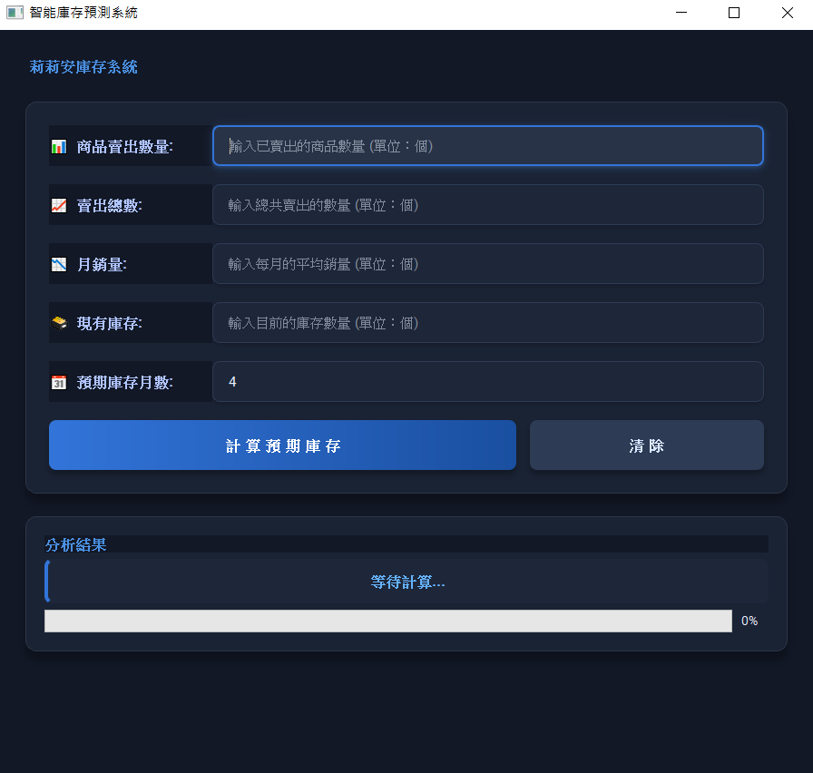

# 蝦皮庫存管理系統

## 簡介
蝦皮庫存管理系統是一個整合了蝦皮商品爬蟲和庫存計算功能的工具，幫助賣家更有效地管理庫存和分析銷售數據。

## 主要功能
- **蝦皮商品爬蟲**：自動抓取蝦皮商品資訊和銷售數據
- **銷售數據分析**：分析商品銷售趨勢和表現
- **庫存計算**：根據銷售數據計算最佳庫存量

## 環境搭建

### 必要套件
```
pip install PyQt5
pip install selenium
pip install psutil
```

### Chrome驅動程式
本程式使用Selenium控制Chrome瀏覽器進行爬蟲，請確保您已安裝：
1. Google Chrome瀏覽器
2. 與您Chrome版本相符的ChromeDriver (可從 https://chromedriver.chromium.org/downloads 下載)

## 使用方法

### 下載專案
```
git clone https://github.com/paulkuo123/InventoryCalculator.git
```

### 切換至專案資料夾
```
cd InventoryCalculator
```

### 執行主程式
```
python main.py
```
執行後會自動開啟網頁介面，您可以在此進行商品搜尋和數據分析。

## Demo


### 額外小功能 - InventoryCalculator
除了主要的爬蟲功能外，本專案還包含一個獨立的庫存計算工具，可以幫助您計算最佳庫存量：
```
python calculator.py
```

## 系統需求
- Python 3.6+
- 作業系統：Windows, macOS, Linux

## Demo


